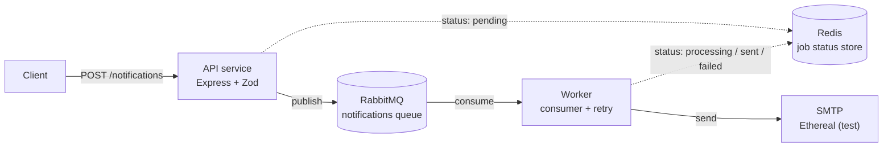
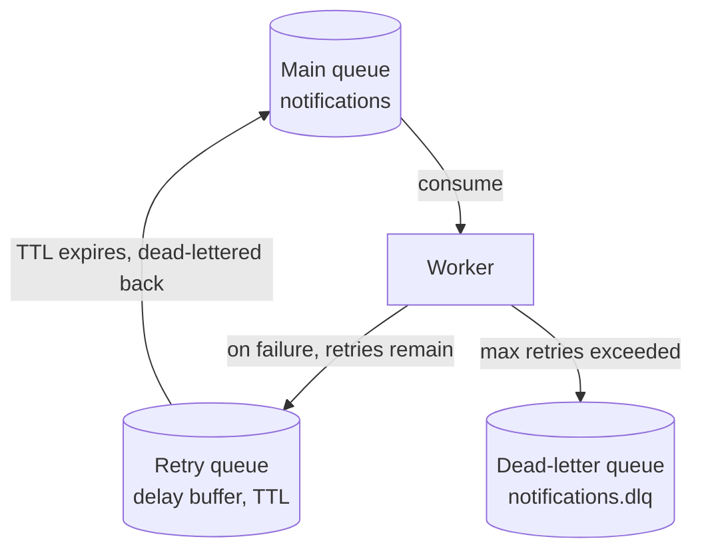

# QueueForge

Asynchronous notification processing system built with Node.js, RabbitMQ, and Redis — designed to decouple request handling from slow, unreliable third-party operations (email/push delivery) using message queues, with automatic retries and job status tracking.

## Why this project

Most CRUD-style portfolio APIs respond synchronously and never fail gracefully. QueueForge demonstrates a different pattern: an API that accepts a request, immediately acknowledges it, and delegates the actual work to background workers — with visibility into job state and resilience when things go wrong (which they always eventually do).

## Architecture

**Core flow** — client request through delivery, with status tracking:



**Retry and dead-letter flow** — how a failed delivery is handled:



The retry queue has no consumer attached — it's a delay buffer. Each failed message is republished there with a per-message TTL (5s, 10s, 20s — exponential backoff). When the TTL expires, RabbitMQ automatically dead-letters the message back to the main queue via its `x-dead-letter-exchange` configuration, no polling or scheduler required. If `MAX_RETRIES` is exceeded, the message goes to the dead-letter queue instead, where it stays inspectable rather than silently disappearing.

**Flow:**
1. Client calls `POST /notifications` with a notification payload.
2. API validates the request, stores an initial job status in Redis (`pending`), publishes the message to RabbitMQ, and immediately responds `202 Accepted` with a `jobId`.
3. A worker process consumes the message, updates status to `processing`, attempts delivery (email via SMTP/test provider).
4. On success → status set to `sent`. On failure → status set to `retrying`, and the job is republished to the retry queue with exponential backoff (5s, 10s, 20s...). Once `MAX_RETRIES` is exceeded, the message moves to the **Dead Letter Queue** and status is set to `failed`.
5. Client can poll `GET /notifications/:jobId/status` at any time to check progress (`pending` → `processing` → `retrying`* → `sent` / `failed`).

## Tech Stack

- **Runtime:** Node.js (ES Modules, npm/yarn workspaces monorepo)
- **API Framework:** Express
- **Message Broker:** RabbitMQ (via `amqplib`) — main queue, retry queue (TTL-based delay), dead-letter queue
- **State:** Redis
- **Email delivery:** Nodemailer (SMTP test provider, e.g. Ethereal/Mailtrap)
- **Containerization:** Docker & Docker Compose
- **Validation:** Zod
- **Testing:** Vitest + Supertest (unit tests with mocks, plus integration tests against real Redis/RabbitMQ)

## Features

- Asynchronous, non-blocking API — clients never wait on the actual delivery
- Job status tracking (`pending`, `processing`, `retrying`, `sent`, `failed`) queryable via API
- Automatic retry with exponential backoff on transient failures (TTL-based delay queue, no polling)
- Dead Letter Queue for messages that exhaust retries — inspectable via the RabbitMQ management UI
- Environment-aware configuration — automatically picks `.env` (Docker) or `.env.local` (local development) based on `NODE_ENV`
- Fully containerized local environment — single `docker compose up --build` to run everything
- Unit and integration test coverage for both the API and the worker

## Getting Started

```bash
git clone https://github.com/mmss1995/queueforge.git
cd queueforge
cp .env.example .env
docker compose up --build
```

This starts:
- `api` — the public-facing REST API
- `worker` — the background notification processor
- `rabbitmq` — broker (management UI at `http://localhost:15672`)
- `redis` — state store

## API Reference

| Method | Endpoint                     | Description                          |
|--------|-------------------------------|---------------------------------------|
| POST   | `/notifications`             | Enqueue a new notification job        |
| GET    | `/notifications/:jobId/status` | Get current status of a job          |
| GET    | `/health`                    | Health check                          |

**Example request:**

```bash
curl -X POST http://localhost:3000/notifications \
  -H "Content-Type: application/json" \
  -d '{
    "type": "email",
    "to": "user@example.com",
    "template": "welcome",
    "data": { "name": "Matteo" }
  }'
```

**Example response:**

```json
{
  "jobId": "5f2c1e3a-8b1d-4b6f-9e2a-1234567890ab",
  "status": "pending"
}
```

## Environment Variables

The project uses two separate env files, selected automatically based on `NODE_ENV`:

- **`.env`** — used when running via Docker Compose (`NODE_ENV=production`). Uses Docker service hostnames (`rabbitmq`, `redis`).
- **`.env.local`** — used for local development outside Docker (`NODE_ENV=development`, the default for `yarn dev`). Uses `localhost`.

```
PORT=3000
RABBITMQ_URL=amqp://rabbitmq:5672   # use amqp://localhost:5672 in .env.local
REDIS_URL=redis://redis:6379        # use redis://localhost:6379 in .env.local
SMTP_HOST=
SMTP_PORT=
SMTP_USER=
SMTP_PASS=
MAX_RETRIES=3
```

Both files are gitignored. Copy `.env.example` to create either one, and fill in real SMTP credentials (e.g. from [Ethereal](https://ethereal.email/create)).

## Project Structure

```
queueforge/
├── api/
│   ├── src/
│   │   ├── app.js                  # Express app config (testable, no listen())
│   │   ├── index.js                # entrypoint, loads env, starts the server
│   │   ├── routes/
│   │   │   └── notifications.js    # POST /notifications, GET /notifications/:jobId/status
│   │   ├── validation/
│   │   │   └── notification.js     # Zod schema
│   │   └── services/
│   │       ├── redisClient.js
│   │       ├── jobStatus.js        # status read/write
│   │       └── queueClient.js      # publishes to RabbitMQ
│   └── Dockerfile
├── worker/
│   ├── src/
│   │   ├── index.js                # entrypoint, loads env, starts the consumer
│   │   ├── consumers/
│   │   │   └── notificationConsumer.js  # handleNotification + startConsumer
│   │   └── services/
│   │       ├── redisClient.js
│   │       ├── jobStatus.js
│   │       ├── emailService.js     # Nodemailer wrapper
│   │       └── queueClient.js      # main / retry / dead-letter queues
│   └── Dockerfile
├── shared/
│   └── src/
│       └── resolveEnvFile.js       # picks .env vs .env.local based on NODE_ENV
├── docker-compose.yml
├── .env.example
└── README.md
```

Every service file above has a matching `*.test.js` alongside it (Vitest).

## Testing

```bash
yarn workspace api test
yarn workspace worker test
```

- **Unit tests** (route validation, consumer retry/DLQ logic, email sending) run in isolation using Vitest mocks — no external services required.
- **Integration tests** (Redis, RabbitMQ) require the real services running: `docker compose up -d redis rabbitmq`.

> **Known issue:** `api/src/services/queueClient.test.js` is currently flaky/failing (the received `jobId` doesn't reliably match the published one, even after purging the queue) — under investigation.

## Roadmap / Next Release

- **Multi-job-type routing** — support additional job types (e.g. push notifications, SMS) with dedicated queues and worker routing logic, instead of a single notification type.
- **Image processing pipeline** — extend the worker architecture to handle a second, heavier job type (e.g. thumbnail generation on upload), to demonstrate queue routing across different workloads.
- **Rate limiting** on the public API using Redis, to protect against request spam.
- Structured logging and basic metrics (job throughput, failure rate)
- Integration tests for the full publish → consume → retry → DLQ flow
- Security hardening on the API (e.g. `helmet` for security headers, `cors` configuration)

## License

MIT